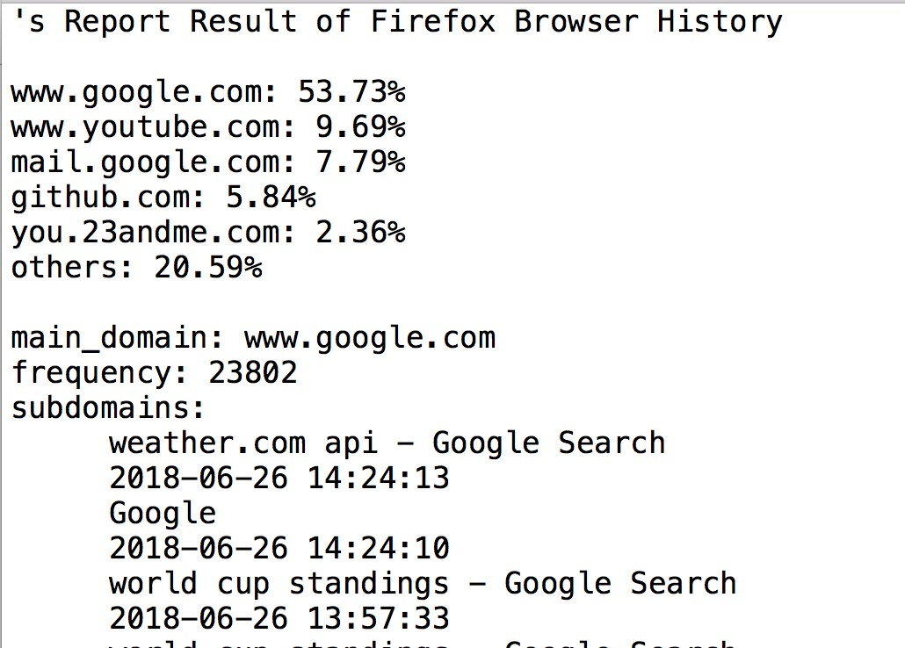

# Diagnose-Your-Browser (DYB): A Project for Digital Wellbeing

## What it does: 
This python program will create txt files that contain the analysis of your browsers' history 
and lists of the visited urls sorted by most visited websites.

## Technique:
Python3 and sqlite3

## Requirement: 
             1. Run this program in Python 3 
             2. Please completely close Google Chrome before running this program.

Available For Windows/Macintosh  
Available For Safari, Google Chrome, and Firefox

If you have installed the psutil library in your system, please run Diagnose.py. 
Otherwise, Please run Diagnose_no_psutil.py on your cmd/terminal. 

# Example 

